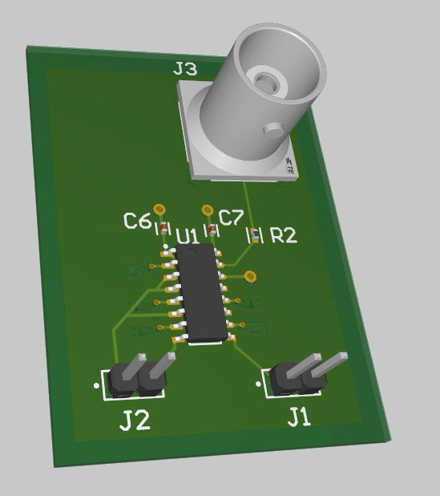
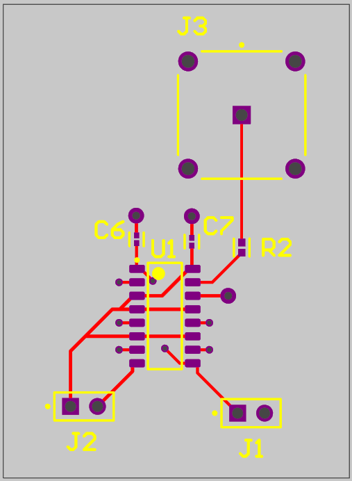
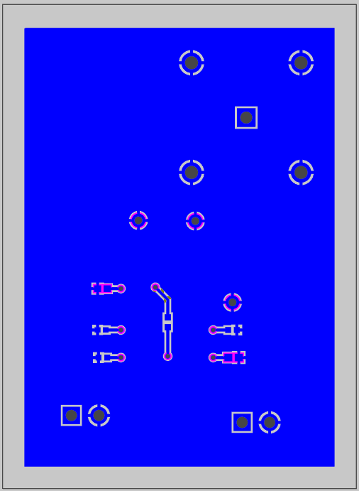
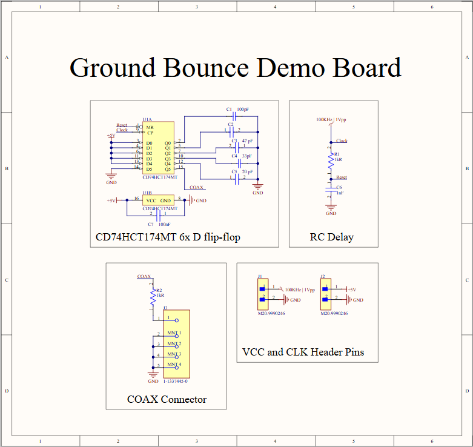

# Ground Bounce Demo PCB

A 2-layer PCB designed to experimentally demonstrate ground bounce, a signal integrity effect caused by bondout lead inductance in IC packaging. Built for ECE173L (High Speed Digital Design) at UC Santa Cruz.

## What it does

Uses a 6-bit D flip-flop (CD74HCT174) to charge five load capacitors (Q0-Q4), then simultaneously discharges them into the ground plane on every clock cycle. An RC delay circuit drives the reset signal, creating repeating bounce events that can be observed on an oscilloscope through a COAX probe at Q5.

## My contribution

Led the Altium design work, including layout, routing, and Gerber generation for fabrication.

## Layout

| Top Layer | Bottom Layer |
|---|---|
|  |  |

## Schematic

## Result

Due to board fabrication delays, the design was verified on breadboard rather than the finished PCB. The breadboard build worked as intended, producing a repeating ~40mV ground bounce spike matching the calculated time constant. A voltage regulator was mistakenly omitted from the design, so the bounce amplitude wasn't independently adjustable, but the effect itself was clearly observable.

Full write-up with oscilloscope captures and calculated bondout inductance is in [`ground_bounce_writeup.pdf`](ground_bounce_writeup.pdf).

## Files

- `PCB2.PcbDoc`, `Project2.PrjPcb` — Altium source files
- `gerbers/` — fabrication-ready Gerber files
- `images/` — schematic and layout renders
- `ground_bounce_writeup.pdf` — full report with measurements and analysis
